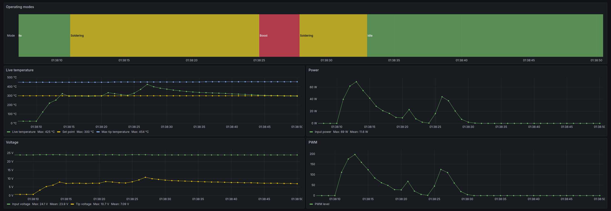

# Pinecil V2 BLE to MQTT Gateway

**This project has been barely tested and might not work as expected. Use at your own risk.**



This project is a BLE to MQTT gateway for the [Pinecil V2](https://wiki.pine64.org/wiki/Pinecil) soldering irons.
It is based on the [Pinecil V2 BLE Services](https://github.com/Ralim/IronOS/blob/dev/Documentation/Bluetooth.md)
from IronOS.

While there are already [some excellent projects](#alternative-projects) that read data from the Pinecil V2 soldering
iron via BLE, this project aims to provide a more flexible and extensible solution by publishing the data to an MQTT
broker. From there, the data can be consumed by other applications or services (e.g. Home Assistant, Grafana).

## Features

- [x] Automatically discover and connect to the Pinecil V2 soldering iron via BLE
- [x] Publish data provided by the soldering iron to an MQTT broker
- [x] Optionally authenticate with the MQTT broker
- [x] Transform raw data into human-readable values
- [x] Can be run as a standalone binary or in a container

## Pre-requisites

- A Pinecil V2 soldering iron
- IronOS firmware version 2.22 or later (might work on 2.21 but not tested)
- A computer with Bluetooth Low Energy support
- An MQTT broker (e.g. [Mosquitto](https://mosquitto.org/))

## Installation

### With containers

1. Pull the image from Docker Hub:
   ```shell
   docker pull excieve/pinecil2mqtt:dev
   ```
2. Run the container (on a Linux machine) with the following command, replacing `mqtt.example.com` with your MQTT broker:
   ```shell
    docker run -d -e P2M_MQTT_HOST=mqtt.example.com -v /run/dbus/:/run/dbus excieve/pinecil2mqtt:dev
   ```
3. Enjoy!

#### Caveats

The container needs access to the host's D-Bus socket to be able to communicate with BLE devices. This is
achieved by mounting the host's D-Bus socket into the container. This might not work on all platforms. 

Additionally, this image is built on an Alpine Linux base image, which is known to be particular about DNS resolution.
If you encounter issues with resolving your MQTT broker's hostname, you might need to use IP address instead. This might
change in the future.

### From source

1. Clone this repository
2. Run `cargo build --release` to build the project
3. Set up a configuration file or environment variables (see [Configuration](#configuration))
4. Run the binary from the `target/release` directory
5. Enjoy!

## Configuration

The configuration file is a simple TOML file, path to which can be passed using the `--config` CLI argument:
```shell
./target/release/pinecil2mqtt --config /path/to/config.toml
```

See `pinecil2mqtt --help` for more information on available CLI arguments.

Here is an example configuration (username and password are optional):

```toml
loglevel = "info"

[mqtt]
host = "mqtt.example.com"
port = 1883
username = "username"
password = "password"
```

Alternatively, you can use environment variables to configure the application:
```shell
P2M_MQTT_HOST=mqtt.example.com P2M_LOGLEVEL=debug ./target/release/pinecil2mqtt
```

Config file and environment variables are merged, with environment variables taking precedence.

## MQTT Data Structure

The data is published every second to an MQTT topic that looks like `pinecil/<device_id>/bulk`, where `<device_id>` is
the unique ID of your Pinecil V2 soldering iron. The payload is a JSON object that looks like this:

```json
{
  "live_temp": 22,
  "set_point": 300,
  "voltage": 51,
  "handle_temp": 229,
  "power_level": 0,
  "power_source": 0,
  "tip_resistance": 62,
  "uptime": 57,
  "last_movement": 56,
  "max_tip_temp": 445,
  "tip_voltage": 685,
  "hall_sensor": 0,
  "operating_mode": 0,
  "power": 0,
  "timestamp": 1715002904,
  "power_source_label": "DCIN",
  "operating_mode_label": "Idle"
}
```

*Note*: This might change in the future with different versions of the firmware.

# Roadmap

- [ ] Write unit tests (I know, I know)
- [ ] Add support for the settings service read characteristics
- [ ] Add support for the settings service write characteristics via MQTT
- [ ] Home Assistant integration
- [ ] Multiple Pinecils support (might already work, but not tested)
- [ ] Test on more platforms (currently only tested on Linux)

# Alternative Projects

- [PineSAM](https://github.com/builder555/PineSAM) — standalone Web UI with WebSocket server in Python
- [Pinecil in-browser app](https://joric.github.io/pinecil/) — Web Bluetooth API-based implementation of a Web UI

# License

This project is licensed under the Apache License, Version 2.0. See the [LICENSE](LICENSE) file for more information.
